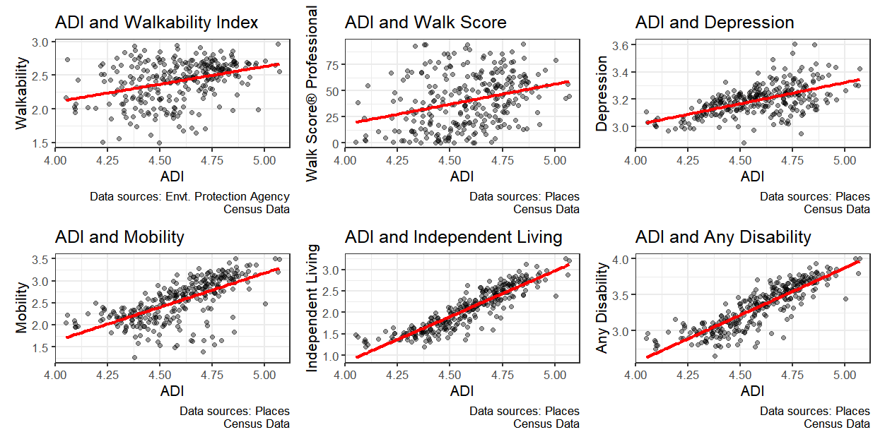

# Walkability, Disability, and Built Environment Disparities in Franklin County, Ohio
This repository contains the full analysis pipeline for mapping and analyzing walkability, environmental accessibility, and built environment disparities in Franklin County, Ohio. The project integrates geospatial datasets including CDC PLACES, ACS, EPA Walkability Index, and WalkScore® Premium data to examine how disability and depression prevalence intersect with walkability and area-level disadvantage.

---



## Project Overview

This R-based analysis includes:

- Extraction and cleaning of CDC PLACES and ACS data for 2021
- Integration of disability, depression, and aging metrics at the census tract level
- Retrieval of WalkScore® Premium API data for custom walkability scores
- Mapping and joining of National Walkability Index (EPA) and road, water, and slope data
- Stratification by the Area Deprivation Index (ADI)
- Creation of descriptive summary tables for policy and planning audiences

---

## Data Sources

| Dataset | Description | Source |
|--------|-------------|--------|
| **CDC PLACES** | Census-tract-level estimates of disability, depression, and related indicators | [CDC PLACES](https://chronicdata.cdc.gov/) |
| **ACS 2021 5-Year Estimates** | Demographics and housing data for Ohio tracts | [Census API](https://api.census.gov/data/key_signup.html) |
| **WalkScore® Premium API** | Custom walkability scores using geolocation | [WalkScore® (by Redfin)](https://www.walkscore.com/professional/research.php) |
| **EPA Walkability Index** | National Walkability Index shapefiles | [EPA Data Commons](https://edg.epa.gov/EPADataCommons/public/OA/WalkabilityIndex.zip) |
| **Ohio Road & Water Features** | Roads, rivers, and area water from the US Census TIGER/Line | [TIGER/Line Shapefiles](https://www.census.gov/geographies/mapping-files/time-series/geo/tiger-line-file.html) |
| **ADI + Slope Data** | Cleaned network data with Area Deprivation Index and sidewalk slope values | Local file (`cleaned_network_franklin_slopes_merged_places_adi_walkability.geojson`) |

---

## 📌 Requirements

- R 4.1 or higher
- Suggested R packages:
  - `tidyverse`, `sf`, `tigris`, `tidycensus`, `crsuggest`, `walkscore`, `gtsummary`, `flextable`
  - Optional: `remotes::install_github("mroberts3000/stmCorrViz")` for topic correlation visualization

---

## WalkScore® Premium API

This project uses the **WalkScore® Premium API** to obtain walkability and bikeability scores for each point. You **must register for your own API key** to run this portion of the analysis:

**➡️ Sign up here**: [WalkScore® API Access (Redfin)](https://www.walkscore.com/professional/research.php)

Then replace the API key string in this line of code:

```r
apikey = "your_own_walkscore_premium_key"
